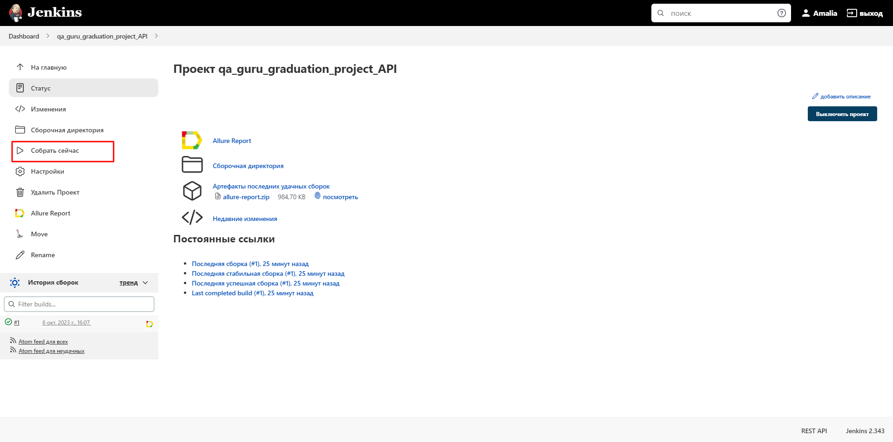
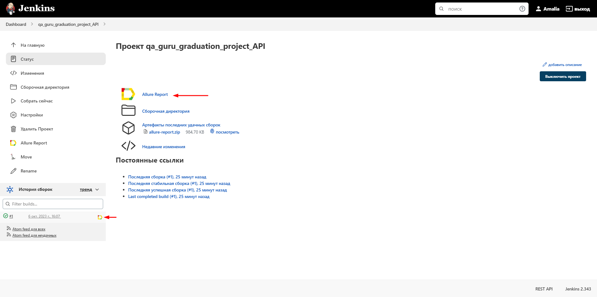

# Пример проекта API автотестов на демо-сайте зоомагазина "petstore"
> https://petstore.swagger.io/ - образец приложения, которое используется для практики REST-запросов.

### Используемые технологии
<p  align="center">
  <code></code>
  <code></code>
  <code></code>
  <code></code>
  <code></code>
  <code></code>
  <code></code>
</p>

## Покрываемый функционал
### Ресурс PET
- Добавление нового животного в магазин
- Редактирование данных созданного животного 
- Получение данных о животном по идентификатору
- Удаление животного по идентификатору 
### Ресурс STORE
- Создание заказа
- Получение данных о заказе по идентификатору
- Удаление заказа по идентификатору


## Запуск тестов


### Для локального запуска
1. Склонируйте репозиторий
2. Откройте проект в PyCharm
3. Введите в териминале команду
``` 
python -m venv .venv
source .venv/bin/activate
pip install -r requirements.txt
pytest .
```

### Запуск тестов в [Jenkins](https://jenkins.autotests.cloud/job/qa_guru_graduation_project_API/)
Нажмите кнопку «Собрать сейчас»
<p></p>

###  Отчетность о прохождении тестов в Allure
#### Если тест запускался локально:
Введите в терминале команду 
```
allure serve allure-results
``` 
#### Если тест запускался в Jenkins
Нажмите Allure Report или кликните по иконке отчёта в завершённой сборке
<p></p>

### Отображение тестов в отчете


